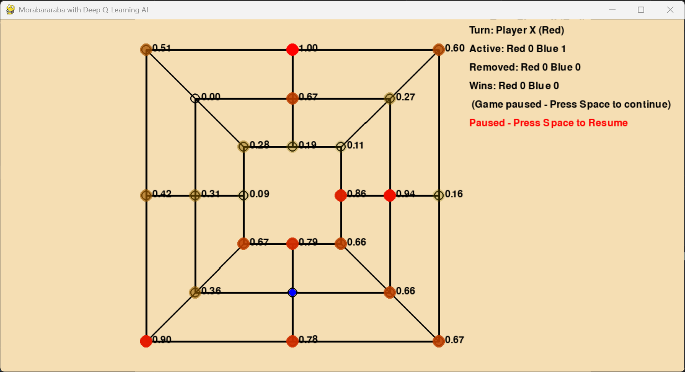

# 🐮 Morabaraba AI

An AI-powered implementation of **Morabaraba**, a traditional African strategy board game. This Python-based version showcases the game's development evolution, from simple multiplayer to Deep Q-Learning integration.



---

## 🎮 Features

✅ **Fully Playable Game**  
✅ **Two-player mode**  
✅ **AI Opponent (Deep Q-Learning)**  
✅ **Game heatmap visualization of AI decisions**  
✅ **Auto-pause between turns for easier observation**  
✅ **Win counters, piece tracking, and game restarts**

---

## 🧠 AI Highlights

The AI uses **Deep Q-Learning**:
- Learns optimal placing moves via a neural network (`ai_dqn.py`)
- Trains using an experience replay buffer and target network
- Displays a heatmap showing the confidence of each move
- Rewards shaped for:
  - Creating mills
  - Blocking opponent mills
  - Setting up mill formations

---

## 📁 File Overview

| File | Description |
|------|-------------|
| `runv4Revised.py` | ✅ Final polished game version with Deep Q-Learning and heatmap. |
| `ai_dqn.py` | Deep Q-Learning agent with reward shaping and model optimization. |
| `old/v1.py` | Two-player-only version (basic). |
| `old/v2.py` | Player vs dumb AI. |
| `run.py` to `runv3PausePlay.py` | Iterative development versions with added features. |

---

## 🛠️ Setup & Running

1. **Install Python 3.8+**  
2. Install requirements (if using AI features):
   ```bash
   pip install pygame torch numpy
   ```
3. Run the game:
   ```bash
   python runv4Revised.py
   ```

---

## 🔍 AI Heatmap Visualization

When AI is playing, green (or red) circles show how confident it is in placing a piece in each spot:

- Brighter = more preferred
- Each spot also shows a probability value

---

## 🚀 Future Ideas

- Smarter AI for moving phase  
- PvP over network  
- Sound effects and animations  
- Web version (e.g. using Pygame Zero or WebAssembly)

---

## 📜 License

MIT License. Free to use and modify — just give credit!
